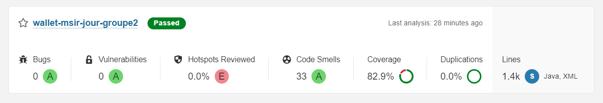
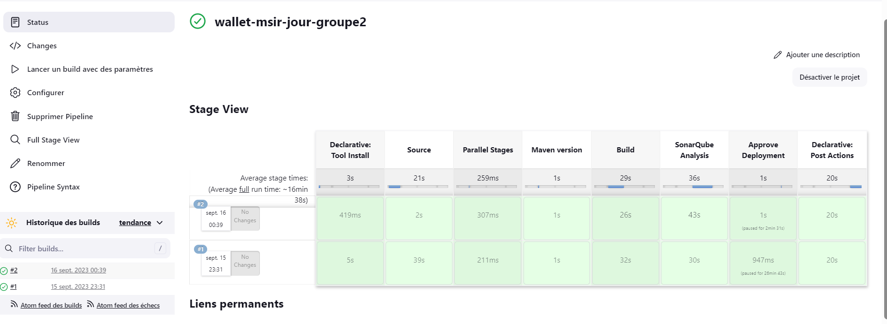
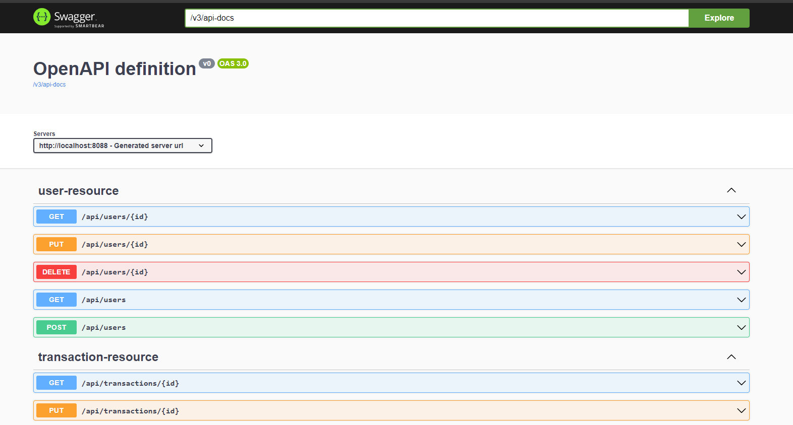
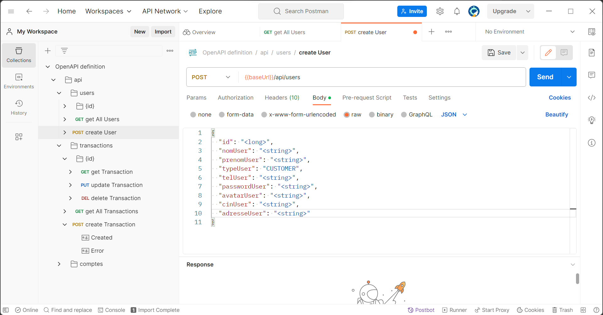
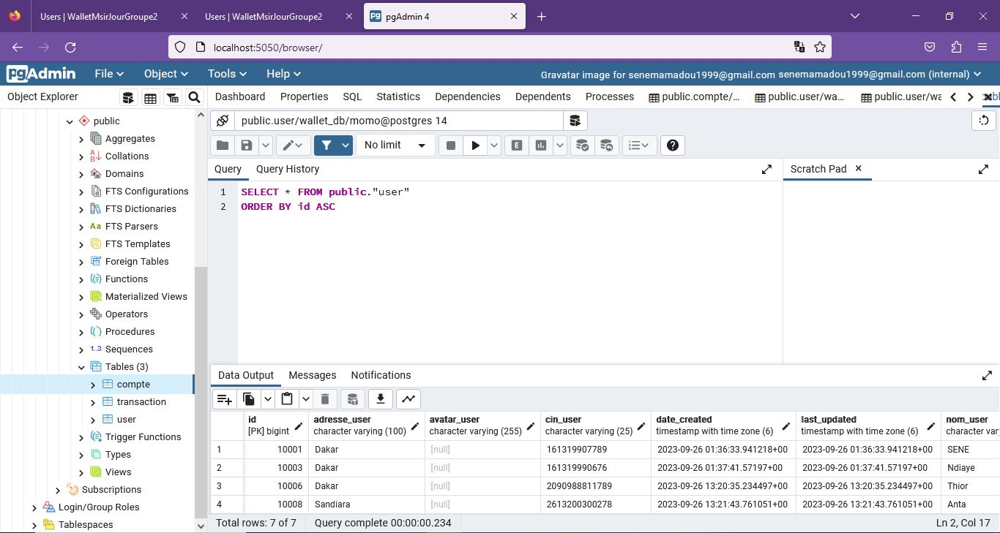

# WalletMsirJourGroupe2

This app was created with Bootify.io - tips on working with the code [can be found here](https://bootify.io/next-steps/).
Feel free to contact us for further questions.

## Development

Update your local database connection in `application.properties` or create your own `application-local.properties` file to override
settings for development.

During development it is recommended to use the profile `local`. In IntelliJ `-Dspring.profiles.active=local` can be
added in the VM options of the Run Configuration after enabling this property in "Modify options".

Lombok must be supported by your IDE. For IntelliJ install the Lombok plugin and enable annotation processing -
[learn more](https://bootify.io/next-steps/spring-boot-with-lombok.html).

After starting the application it is accessible under `localhost:8088`.

## Build

The application can be built using the following command:

```
mvnw clean package
```

Start your application with the following command - here with the profile `production`:

```
java -Dspring.profiles.active=production -jar ./target/wallet-msir-jour-groupe2-0.0.1-SNAPSHOT.jar
```

If required, a Docker image can be created with the Spring Boot plugin. Add `SPRING_PROFILES_ACTIVE=production` as
environment variable when running the container.

```
mvnw spring-boot:build-image -Dspring-boot.build-image.imageName=com.wallet/wallet-msir-jour-groupe2
```

## Some images regarding the application








## Further readings

* [Maven docs](https://maven.apache.org/guides/index.html)  
* [Spring Boot reference](https://docs.spring.io/spring-boot/docs/current/reference/htmlsingle/)  
* [Spring Data JPA reference](https://docs.spring.io/spring-data/jpa/docs/current/reference/html/)  
* [Thymeleaf docs](https://www.thymeleaf.org/documentation.html)  
* [Bootstrap docs](https://getbootstrap.com/docs/5.3/getting-started/introduction/)

# Project presented by group 2 composed by:
### Moussa THIOR
### Mamadou SENE
### Couly Faye
### Ndeye Khady SY

# Diadieuf. 👍😁

